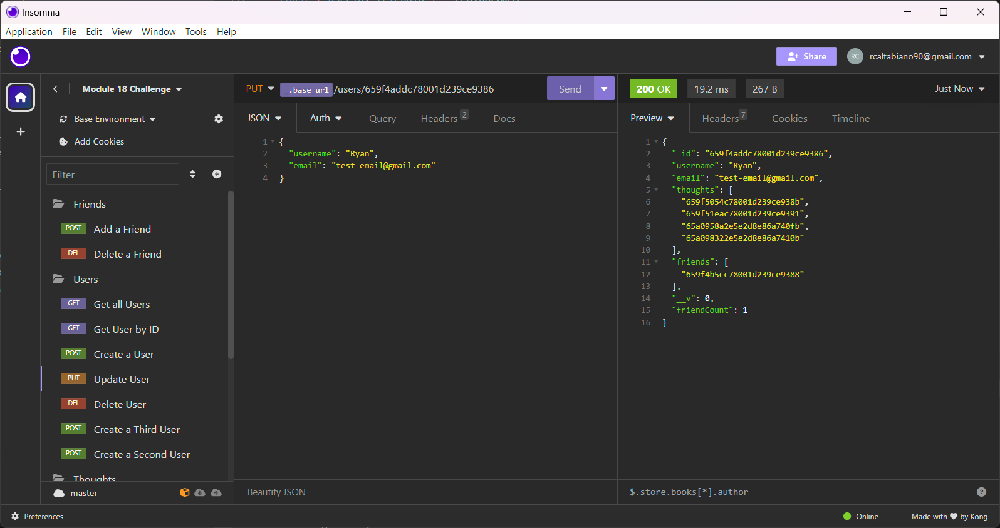
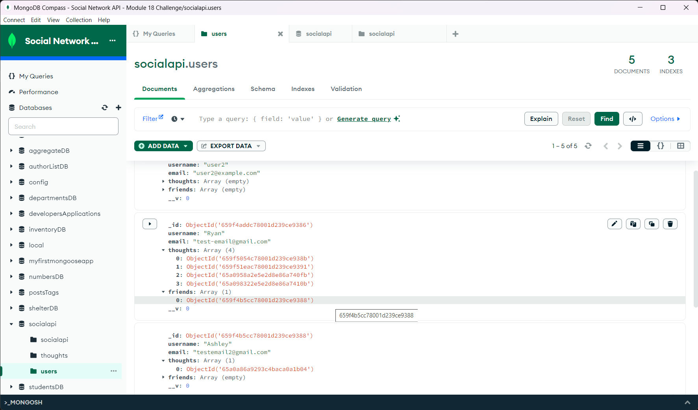
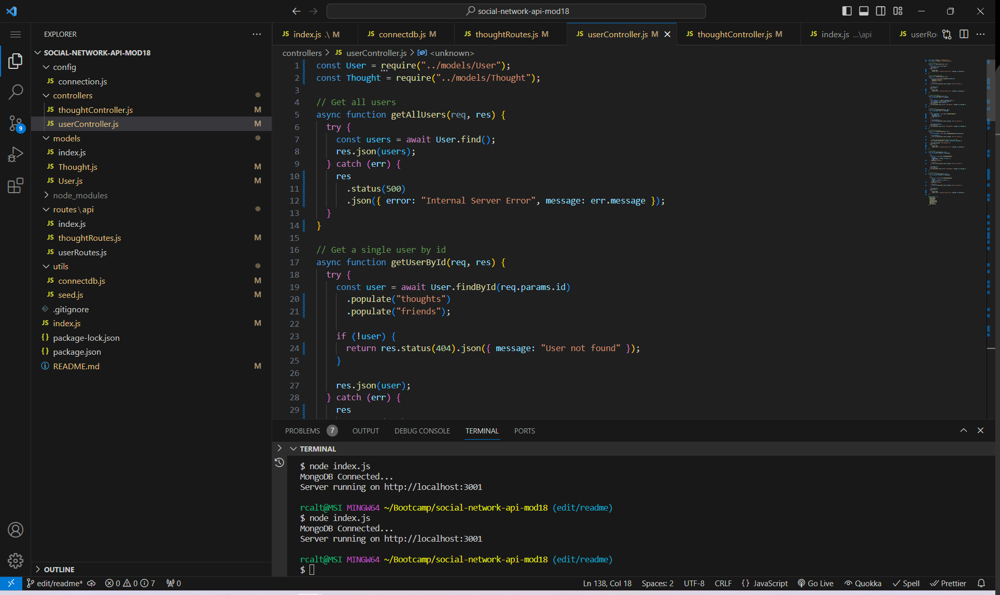

# Social Network API - Module 18 Challenge

## Table of Contents

1. [Description](#description)
2. [Installation](#installation)
3. [Usage](#usage)
4. [Contributors](#contributors)
5. [License](#license)
6. [Link](#link)
7. [Screenshots](#screenshots)

## Description

This project is a backend database that allows the user to manipulate data in various ways. The app has functionality for calling all users in the database, adding, deleting and updating users as well as adding, deleting, and updating user thoughts. The user is allowed to add or delete reactions to various thoughts and there is a feature that allows the user to add and remove friends stored in the database. This app has functionality in social media projects but can also be used in business to review and react to product listings. I learned a great deal working through and troubleshooting this project and this particular module was very interesting for me because I planned to integrate this functionality in my own business site going forward. 

## Installation

This project does not require direct installation outside of the necessary packages to run it through npm. However, the user needs to have MongoDB Compass as well as Insomnia to be able to use it in its current state.

## Usage

To use this app, all necessary npm packages must be installed. From there, run node index.js. Once the app is live on localhost, you can use Insomnia to manipulate the data in various ways through the various IDs and routes. You can use the app to add/remove reactions and friends, as well as create, update, and delete friends/thoughts in various ways. The information in the database can also be referenced through MongoDB Compass.

## Contributors

There were no source files for this project.

## License

This app does not have a license.

## Link

[Demo](https://drive.google.com/file/d/17j8vpMMKV7n8L5sBxR2m0_crlmodbN8w/view)

## Screenshots

